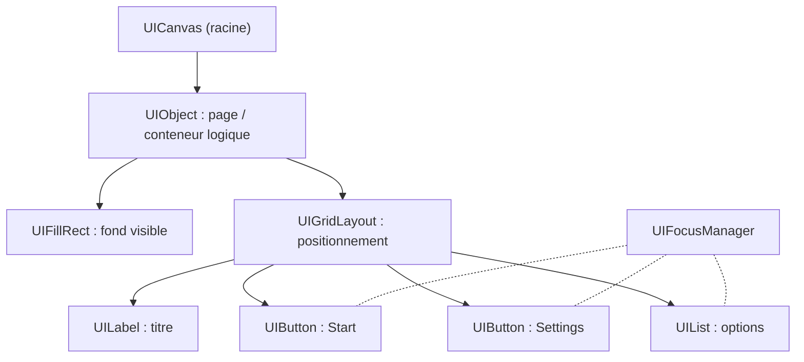
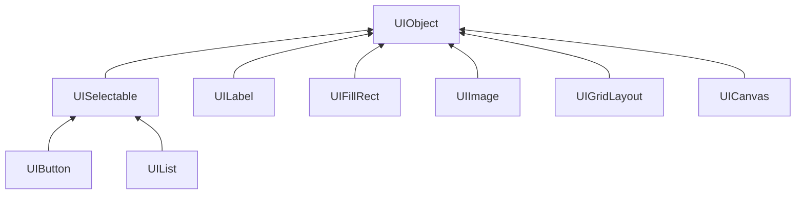

# Guide d'utilisation des UIObjects du moteur

Ce document décrit comment utiliser les UIObjects fournis par le moteur pour construire des interfaces utilisateur complètes.
L'objectif est pratique : montrer comment composer des écrans, organiser les éléments, gérer la navigation et transmettre des intentions au gestionnaire d'interface (`GameUIManager`).

## Principe général

L'interface du moteur est pensée comme un arbre d'objets dont la racine est un `UICanvas`.
Chaque élément que vous utilisez est fourni sous la forme d'une structure prête à l'emploi ; votre rôle est d'instancier ces structures, de configurer leurs propriétés et de les attacher à l'arbre.
La boucle UI du moteur se charge ensuite d'appeler les callbacks d'update et de rendu.
Pour garder le code clair et maintenable, les callbacks utilisateurs ne doivent pas exécuter la logique de jeu directement : ils doivent exprimer une intention (par exemple "démarrer la partie") en écrivant une valeur dans `GameUIManager` (champ `m_nextAction`).
La logique réelle est ensuite exécutée par le manager ou la boucle principale.

## Architecture d'écran (schéma)

Un écran typique est composé d'un conteneur logique (`UIObject`), d'un fond visible (`UIFillRect` ou `UIImage`) et d'un ensemble de widgets disposés par un conteneur de layout (`UIGridLayout`) ou positionnés directement. Le `UIFocusManager` gère la navigation entre les éléments interactifs.


## Démarche recommandée

Commencez par récupérer le `UICanvas` attaché au `GameUIManager`, puis créez un `UIObject` qui servira de racine pour la page.

Ce conteneur logique facilite la gestion de la page, en permettant par exemple sa destruction complète (en supprimant uniquement la racien) lors d'un changement de page.
Si le conteneur principal doit être visible, ajoutez en enfant un `UIFillRect` ou une `UIImage` pour le fond ou modifier votre `UIObject` principal pour l'un de ces éléments.
Pour positionner proprement plusieurs éléments, installez un `UIGridLayout` sous le conteneur : il vous évite des positionnements en dur et facilite l'adaptation aux différentes résolutions.
Ensuite, ajoutez vos `UILabel`, `UIButton` et `UIList` comme enfants du layout ou du conteneur.

Les éléments interactifs (boutons, listes) doivent être enregistrés auprès du `UIFocusManager` afin que la navigation au clavier et au gamepad fonctionne correctement.
Le `UIFocusManager` calcule automatiquement la navigation en fonction des entrées de l'utilisateur et du positionnement actuel des éléments enregistrés.
Il appelle aussi automatiquement les callbacks enregistrés sur les éléments lors d'actions de l'utilisateur.

Vous pouvez enregistrer des callbacks pour les interactions utilisateur sur les éléments héritant de `UISelectable`.
Des fonctions sont prévues à cet effet dans chaque élément interactif, comme par exemple :
- `UIButton_setOnClickCallback()` pour les boutons,
- `UIList_setOnItemChangedCallback()` pour les listes.

Dans vos callbacks, évitez d'exécuter directement la logique de l'action associée. Enregistrez plutôt une intention dans la classe qui gère votre page (par exemple en modifiant le membre `m_nextAction` de la  `GameTitlePage`) puis exécutez l'action plus tard dans la fonction `update()` associée (par exemple `GameTitlePage_update()`). Si l'action nécessite un changement de page, vous ne pouvez pas supprimer la page actuelle pendant l'exécution de sa méthode update, vous donnez alors l'information à son `GameUIManager` en modifiant son membre `m_nextAction`. C'est ensuite le `GameUIManager` qui effectuera le changement de page dans sa propre méthode d'update.
Cette séparation rend l'UI fiable et testable tout en évitant les effets de bord.

## Rôles et usage des UIObjects

Chaque type d'objet a un usage bien défini.
- `UIObject` est un conteneur logique ; il sert à grouper et à activer/désactiver des sous-arbres et n'a pas forcément d'apparence visuelle.
- `UIFillRect` permet de créer un panneau de fond visible en contrôlant couleur et opacité.
- `UIImage` affiche un sprite (icône ou bordure) accessible via l'`AssetManager` et s'emploie pour la décoration.
- `UILabel` affiche du texte simple et doit être configuré avec sa chaîne, sa couleur et son ancrage.
- `UIButton` est le contrôle cliquable : on lui assigne un label ou un sprite, on configure les couleurs/sprites pour chaque état (normal, focus, pressed) et on place la logique utilisateur avec `UIButton_setOnClickCallback()` (qui doit produire une intention).
- `UIList` expose un ensemble d'items textuels avec un index courant ; il est utile pour les réglages à choix multiples et peut notifier les changements via un callback qui peut être affecté via `UIList_setOnItemChangedCallback()`.
-  `UIGridLayout` organise les enfants en grille (rows/cols, paddings, spacings) et doit être privilégié pour construire des interfaces adaptatives.

Dans ce moteur l'héritage est simulé en C par inclusion d'une structure de base comme premier membre des structs dérivées (par exemple UISelectable ou UIObject inclus dans UIButton, UIFillRect, etc.).
Cette disposition permet de caster en toute sécurité un pointeur dérivé vers la structure de base et d'appeler les fonctions "génériques" définies pour la classe de base.
Les méthode prennent un `void* self` en premier argument et vérifient le type à l'exécution via `UIObject_isOfType(...)` en configuration Debug.
Ainsi, les méthodes de base peuvent être invoquées sur n'importe quel objet "héritant".
Le diagramme suivant représente l'arbre d'héritage des UIObjects.



On peut par exemple définir l'objet parent d'un `UIFillRect` avec la méthode `UIObject_setParent()` de sa classe mère.

```c
UIFillRect *infoBack = UIFillRect_create("main-panel", g_colors.gray8);
UIGridLayout* infoLayout = UIGridLayout_create("info-layout", 2, 2);
UIObject_setParent(infoLayout, infoBack);
```

## Placement des éléments

Il est fréquent d'utiliser un `UIObject` pur comme panneau logique lorsque l'on souhaite grouper des éléments sans ajout de rendu.
Pour un panneau visible, attachez un `UIFillRect` ou une `UIImage` en enfant immédiat du `UIObject`.
Pour positionner plusieurs éléments, utilisez un `UIGridLayout` qui s'occupe de la disposition automatique.
Lors de sa création, définissez le nombre de lignes et de colonnes.
D'autres paramètres peuvent être personnalisés après sa création comme les espacements (padding, spacing), les alignements (horizontal et vertical) et les dimensions de chaque ligne/colonne.
Si une ligne ou une colonne doit occuper tout l'espace disponible, définissez sa taille avec la valeur `-1.0f`.
Ajoutez ensuite les éléments (labels, boutons, listes) avec la fonction `UIGridLayout_addObject()` qui prend en paramètres le layout, l'objet à ajouter, l'indice de sa ligne et l'indice de sa colonne dans la grille ainsi que le nombre de lignes et de colonnes sur lesquels il s'étend (généralement 1 et 1).
Un `UIGridLayout` met automatiquement à jour les rectangles de ses enfants lors de son propre update, en fonction de la taille disponible et des paramètres définis.

Il est aussi possible de positionner les éléments directement sous un `UIObject` en définissant leurs rectangles manuellement.

Chaque objet UI possède un `UIRect` local qui définit la position et la taille de l'objet par rapport à son parent.
Il utilise pour cela deux composantes complémentaires :
- des ancres relatives (`anchorMin`, `anchorMax`) ;
- des offsets absolus (`offsetMin`, `offsetMax`).
Par convention dans le projet, les composantes `min` représentent toujours le coin bas‑gauche et les composantes `max` le coin haut‑droite de l'écran.

Les ancres sont des coordonnées relatives (généralement dans l'intervalle [0,1]) exprimées par rapport au rectangle du parent.
Elles déterminent la position de référence dans l'espace du parent.
Les offsets sont des translations absolues (en unités indépendantes de la résolution de l'écran) appliquées sur ces ancres ; `offsetMin` déplace le coin bas‑gauche, `offsetMax` déplace le coin haut‑droite.

En pratique, cette séparation permet de décrire des comportements réactifs (responsive) : on utilise les ancres pour définir le positionnement relatif (par exemple : occuper toute la largeur, s'aligner en haut, se centrer), et on utilise les offsets pour fixer une taille absolue ou ajouter des marges/paddings.

Quelques motifs d'usage courants :

- Élément centré de taille fixe (largeur = w, hauteur = h)  
  Pour centrer un objet avec une taille explicite, on place les deux ancres au même point (ici le centre du parent) et on définit des offsets symétriques :

```c
rect->anchorMin = vec2(0.5f, 0.5f);
rect->anchorMax = vec2(0.5f, 0.5f);
rect->offsetMin = vec2(-w * 0.5f, -h * 0.5f);
rect->offsetMax = vec2(+w * 0.5f, +h * 0.5f);
```

- Panneau qui remplit tout le parent mais avec un padding (gauche, bas, droite, haut)  
Ici les ancres couvrent tout l'espace du parent ; les offsets négatifs/positifs ajoutent le padding :

```c
rect->anchorMin = vec2(0.0f, 0.0f);
rect->anchorMax = vec2(1.0f, 1.0f);
rect->offsetMin = vec2(+paddingLeft, +paddingBottom);
rect->offsetMax = vec2(-paddingRight, -paddingTop);
```

- Barre ancrée en haut, pleine largeur, hauteur fixe h  
On ancre en haut (y = 1) et on règle le décalage vertical via offsets :

```c
rect->anchorMin = vec2(0.0f, 1.0f);
rect->anchorMax = vec2(1.0f, 1.0f);
rect->offsetMin = vec2(0.0f, -h);
rect->offsetMax = vec2(0.0f, 0.0f);
```

Points importants à garder en tête :

- Les ancres définissent la base relative ; les offsets ajoutent la position/tailles réelles. Pour obtenir la position absolue (AABB), le moteur calcule les positions absolue en cascade depuis les parents vers les enfants à chaque frame.
- Pour des UI adaptatives, privilégiez des ancres relatives larges (par ex. `[0,1]` en x pour occuper toute la largeur) et réservez les offsets aux paddings et hauteurs/largeurs fixes. Inversement, pour des éléments strictement pixel‑par‑pixel, ancrez les deux côtés au même point et utilisez des offsets pour définir la taille.
- Toujours respecter la convention `min = bas‑gauche`, `max = haut‑droite` lorsque vous calculez offsets manuellement. Se tromper de signe ou d'orientation produit des éléments inversés ou avec des tailles négatives.
- Quand vous composez des layouts (par ex. `UIGridLayout`) : le layout définit les `UIRect` enfants pour vous. N'intervenez pas manuellement.

En résumé, pensez au `UIRect` comme à deux couches : des ancres relatives qui définissent la référence dans le parent, et des offsets absolus qui fixent la taille ou les marges.

## Focus et navigation

Le `UIFocusManager` centralise la gestion du focus pour les `UISelectable`.
Il permet la navigation par flèches, via la souris ou un gamepad, et déclenche l'activation de l'élément sélectionné lors de la validation.
Il est important d'offrir un retour visuel clair (couleur, sprite ou bordure différente) lorsque le focus change afin d'améliorer l'accessibilité et l'expérience.
Les éléments interactifs doivent être enregistrés auprès du `UIFocusManager` avec la fonction `UIFocusManager_addSelectable()`.
Pour retirer un élément, utilisez `UIFocusManager_removeSelectable()`.
Vous pouvez également retirer tous les éléments en une fois avec `UIFocusManager_clear()`.
Le premier élément sélectionné doit être défini avec `UIFocusManager_setFocused()`.

## Callbacks

Les éléments interactifs (boutons, listes) permettent d'enregistrer des callbacks pour réagir aux actions de l'utilisateur.
Ces callbacks doivent être utilisés pour exprimer une intention plutôt que pour exécuter directement la logique de jeu.

Pour otenir les informations importantes dans les callbacks, vous passez un pointeur vers la structure gérant la page lors de la création des boutons.
Cette fonction est commune à tous les éléments interactifs héritant de `UISelectable` et s'appelle `UISelectable_setUserData()`.
Pour identifier l'élément déclencheur dans le callback ou enregistrer l'action associée, vous pouvez utiliser la fonction `UISelectable_setUserId()` qui assigne un identifiant entier à l'élément.

Voici un exemple typique de callback pour un bouton :
```c
static void GameTitlePage_onClick(void* selectable)
{
    GameTitlePage* self = (GameTitlePage*)UISelectable_getUserData(selectable);
    int action = UISelectable_getUserId(selectable);
    self->m_nextAction = action;
}
```
On voit que le callback récupère la structure `GameTitlePage` via `UISelectable_getUserData()` et l'identifiant de l'action via `UISelectable_getUserId()`. Il enregistre ensuite l'intention dans `self->m_nextAction`. C'est cette valeur qui sera lue plus tard par la fonction `update` de la `GameTitlePage` pour exécuter l'action réelle.

La création des boutons présents dans la `GameTitlePage` avec l'enregistrement du callback et des données utilisateur se fait ainsi :
```c
UIButton* button = UIButton_create("start-button", font);
UIButton_setLabelString(button, "Start");
UIButton_setOnClickCallback(button, GameTitlePage_onClick);
UISelectable_setUserData(button, self);
UISelectable_setUserId(button, GAME_UI_ACTION_START);
```

## Exemple : écran principal

Imaginez la création d'un écran principal appelé `MainPage`.
Vous créez un `UIObject` racine et lui ajoutez un `UIFillRect` semi‑transparent pour délimiter visuellement la zone.
Vous placez un `UIGridLayout` à trois lignes et, dans chaque ligne, vous ajoutez respectivement un `UILabel` pour le titre, un `UIButton` "Start" et un `UIButton` "Settings". Vous enregistrez les deux boutons auprès du `UIFocusManager`.

Pour otenir les informations importantes dans les callbacks, vous passez un pointeur vers la structure `MainPage` lors de la création des boutons.
Le callback du bouton " Start" n'appelle pas directement la scène de jeu : il fixe `GameUIManager->m_nextAction = GAME_UI_ACTION_START`.
La boucle de jeu lit cette valeur et démarre le niveau. Cette approche garde l'interface indépendante de la logique et facilite le changement ultérieur du comportement.

## Fichiers associés

L'interface utilisateur de l'application est réalisée avec les fichiers suivants :
- `application/src/ui/game_ui_manager.h` : gestionnaire principal de l'UI, responsable des changements de page.
- `application/src/ui/game_title_page.h` : écran titre avec boutons Start et Settings.
- `application/src/ui/game_settings_page.h` : écran des réglages avec une liste d'options.
- `application/src/common/ui_style.h` : définitions du style visuel des boutons et des listes.

Les UIObjects sont définis dans `engine/src/ui/`.
Les fonctions disponibles pour chaque UIObject sont documentées dans les fichiers d'en-tête correspondants.
